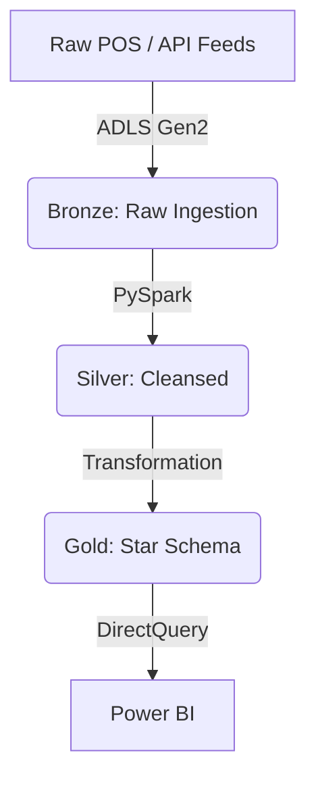

# End-to-End Retail Sales Data Engineering Project

A production-grade, enterprise-scale data pipeline that ingests raw Point-of-Sale (POS) data, processes it through a unified Lakehouse **Medallion Architecture**, and serves an optimized dimensional star-schema model to **Power BI** for executive insights.

---

## 🌐 Live Project Showcase
🚀 **Interactive Web Application:** [Explore the Live App Presentation](https://end-to-end-real-world-project.lovable.app/)
*   *Click the link above to view the full product slide narrative, architectural 

## 🎯 Business Case & Objectives
Fragmented retail POS systems often trap transactional data, creating reporting delays. This project builds a centralized, high-throughput lakehouse to provide near real-time visibility into sales performance, margin analysis, and YTD forecasting.

---

## 🏗️ Architecture & Data Flow

The platform uses a three-tier Lakehouse design pattern (Bronze, Silver, Gold) implemented with Azure Databricks and Delta Lake.

---

## 💻 Tech Stack
*   **Orchestration & Compute:** Azure Databricks (Spark)
*   **Storage & Table Format:** ADLS Gen2, Delta Lake
*   **Visualization:** Power BI

---

## 📐 Dimensional Data Modeling

The Gold layer utilizes a **Star Schema** with a central fact table (`fact_sales`) and associated dimensions (`dim_date`, `dim_customer`, `dim_store`, `dim_product`) for optimal query performance.

---

## 🚀 Deployment & Operational Guide

### 1. Prerequisites
*   Azure Subscription & Databricks Workspace.
*   ADLS Gen2 Account with hierarchical namespaces enabled.

### 2. Pipeline Execution
Run notebooks sequentially: `01_bronze_ingestion.py`, `02_silver_cleansing.py`, `03_gold_star_schema.py`.

---
*Project designed for enterprise-grade analytics evaluation.*

