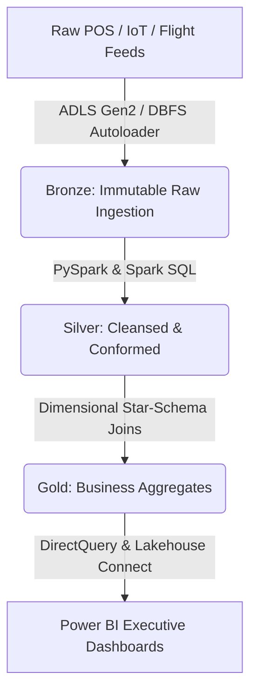

# End-to-End Enterprise Data Engineering Portfolio

A production-grade, multi-pipeline data platform built using Azure Databricks, Spark SQL, and Delta Lake's **Medallion Architecture**. This repository showcases comprehensive pipeline engineering—from structured IoT sensor feeds to high-throughput flight logistics tracking—culminating in business-ready **Power BI** executive suites.

---

## 🌐 Live Project Showcase
🚀 **Interactive Web Application:** 👉 *[Live Project Presentation Interface](https://lovableproject.com)
*Click the link above to view the full product slide narrative, architectural breakdowns, and interactive platform insights for this solution.*

---

## 🗺️ Phase 1: Strategic Planning & Roadmap

Before writing a line of code, the entire end-to-end architecture and timeline were mapped out to align data engineering deliverables with business milestones.

*Figure 1: Canva-designed 22-step workflow planning, implementation schedule (Q3/Q4), resource allocation layout, and project milestone checkpoints.*

---

## 🏗️ Core Architecture & Data Flow

The platform implements decoupled compute and storage using Azure Databricks clusters and Delta Lake tables to progressively refine raw data.

---

## 📷 Technical Deep-Dive & Execution Tour

### 1. High-Velocity Streaming Ingestion (Bronze Layer)
The platform utilizes optimized file-system schemas and **Spark AutoLoader** to automatically detect and ingest high-volume data streams (e.g., IoT sensor telemetry, global flight logistics) directly into the lakehouse format.

| Ingestion System | Schema Blueprint & Ingest Trace |
| :--- | :--- |
| **Delta Lake Schema Browser:** Ingesting structured sensor CSV streams with automated schema mapping (`STRING`, `INTEGER`, `TIMESTAMP`, `FLOAT`). |  |
| **Spark AutoLoader Pipeline:** Pointing directly to cloud object directories (`dbfs:/databricks-datasets/flights/`) to stream raw JSON feeds seamlessly. |  |

---

### 2. Schema Enforcement, Cleaning & Validation (Silver Layer)
Data quality is strictly managed using **Spark SQL constraint mechanisms**. Silver tables enforce primary keys (`NOT NULL`), check value bounds, isolate anomalies, and carry out structured **Delta Lake UPSERTs (MERGE INTO)** to keep transaction layers fresh without duplicating rows.

*Figure 4: Production Spark SQL script establishing data consistency via validation check constraints and optimized merge-on-read logic.*

---

### 3. Star-Schema Modeling & Aggregation (Gold Layer)
Refined facts and dimension tables are constructed for high-performance reporting. Analytical views are queried via a **Databricks SQL Warehouse** to handle granular slice-and-dice requests with minimal latency.

| SQL Warehouse Semantic Layer | Integrated System Telemetry |
| :--- | :--- |
| **SQL Serving Engine:** Running downstream analytical joins across `gold_fact_sales`, `gold_dim_customer`, and logistics tables. |  |
| **Logistics Reporting Engine:** Direct SQL aggregation parsing global tracking data to sort distribution frequencies instantly. |  |

---

### 4. Interactive Power BI Executive Dashboard
Aggregated Gold-layer facts are linked straight to **Power BI Desktop**, transforming complex data transformations into clean, visual business metrics.

*Figure 7: Live Power BI report plotting time-intelligence trends across dimensions to deliver immediate revenue and volume insights.*

---

## 💻 Tech Stack
*   **Orchestration & Compute:** Azure Databricks (PySpark, Spark SQL, AutoLoader)
*   **Storage & Table Format:** Azure Data Lake Storage (ADLS Gen2), Delta Lake
*   **Serving Layer:** Databricks SQL Warehouse
*   **Visualization & Presentation:** Power BI Desktop, Lovable App Engine

---

## 🚀 Deployment & Operational Guide

### 1. Directory Setup
Before running the pipelines, ensure your local screenshot files are uploaded to GitHub under the following paths:
*   `docs/images/project_planning_roadmap.png` (From your Canva template)
*   `docs/images/bronze_schema_browser.png` (From your raw sensor schema view)
*   `docs/images/autoloader_ingestion.png` (From your flights autoloader notebook)
*   `docs/images/databricks_cleaning_validation.png` (From your Spark SQL constraint script)
*   `docs/images/sql_warehouse_serving.png` (From your customer dim / sales fact query)
*   `docs/images/logistics_sql_analytics.png` (From your flight origin bar graph view)
*   `docs/images/powerbi_dashboard_draft.png` (From your live Power BI desktop file)

### 2. Execution Sequence
Run notebooks sequentially to process data through the architecture:
1.  `01_bronze_ingestion.py`
2.  `02_silver_cleansing.py`
3.  `03_gold_star_schema.py`

---
*Project designed for enterprise-grade analytics evaluation.*

